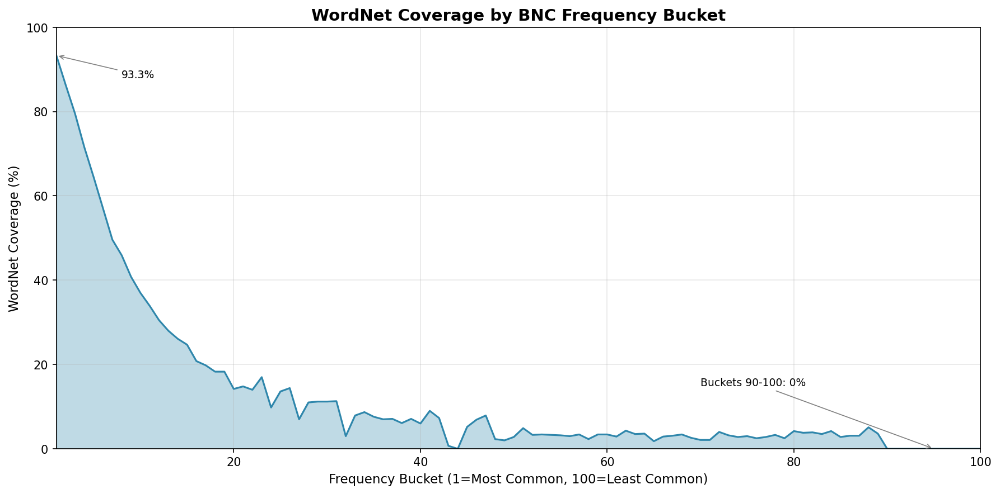

# WordNet Coverage by Frequency Bucket

Analysis of how many BNC words in each frequency bucket are also found in WordNet.



## Summary

| Bucket Range | Avg Coverage | Description |
|--------------|--------------|-------------|
| 1-10 | **62.5%** | Common words, mostly in WordNet |
| 11-20 | **23.4%** | Less common, many proper nouns |
| 21-30 | **11.1%** | Specialized vocabulary |
| 31-50 | **5.2%** | Rare terms, jargon |
| 51-89 | **3.2%** | Very rare, mostly proper nouns |
| 90-100 | **0.0%** | Corpus artifacts, codes, typos |

## Key Insights

- **Bucket 1** (most frequent words) has **93.3% coverage** in WordNet
- Coverage drops steadily through bucket 20 (~14%)
- **Buckets 90-100** have **0% coverage** — these contain numeric codes, special characters, and corpus artifacts that aren't dictionary words
- The steep drop-off shows BNC includes many words WordNet doesn't: proper nouns, technical terms, British spellings, compound words, etc.

## Full Results

| Bucket | Total Words | In WordNet | Coverage |
|--------|-------------|------------|----------|
| 1 | 6,695 | 6,245 | 93.3% |
| 2 | 6,694 | 5,778 | 86.3% |
| 3 | 6,694 | 5,324 | 79.5% |
| 4 | 6,694 | 4,788 | 71.5% |
| 5 | 6,694 | 4,310 | 64.4% |
| 6 | 6,695 | 3,816 | 57.0% |
| 7 | 6,694 | 3,323 | 49.6% |
| 8 | 6,694 | 3,070 | 45.9% |
| 9 | 6,694 | 2,733 | 40.8% |
| 10 | 6,694 | 2,475 | 37.0% |
| 11 | 6,694 | 2,270 | 33.9% |
| 12 | 6,695 | 2,043 | 30.5% |
| 13 | 6,694 | 1,873 | 28.0% |
| 14 | 6,694 | 1,747 | 26.1% |
| 15 | 6,694 | 1,654 | 24.7% |
| 16 | 6,694 | 1,393 | 20.8% |
| 17 | 6,694 | 1,328 | 19.8% |
| 18 | 6,695 | 1,227 | 18.3% |
| 19 | 6,694 | 1,224 | 18.3% |
| 20 | 6,694 | 950 | 14.2% |
| 21 | 6,694 | 988 | 14.8% |
| 22 | 6,694 | 935 | 14.0% |
| 23 | 6,694 | 1,135 | 17.0% |
| 24 | 6,695 | 654 | 9.8% |
| 25 | 6,694 | 909 | 13.6% |
| 26 | 6,694 | 967 | 14.4% |
| 27 | 6,694 | 467 | 7.0% |
| 28 | 6,694 | 739 | 11.0% |
| 29 | 6,694 | 752 | 11.2% |
| 30 | 6,695 | 751 | 11.2% |
| 31 | 6,694 | 755 | 11.3% |
| 32 | 6,694 | 200 | 3.0% |
| 33 | 6,694 | 526 | 7.9% |
| 34 | 6,694 | 585 | 8.7% |
| 35 | 6,694 | 506 | 7.6% |
| 36 | 6,695 | 468 | 7.0% |
| 37 | 6,694 | 474 | 7.1% |
| 38 | 6,694 | 408 | 6.1% |
| 39 | 6,694 | 477 | 7.1% |
| 40 | 6,694 | 401 | 6.0% |
| 41 | 6,694 | 600 | 9.0% |
| 42 | 6,695 | 489 | 7.3% |
| 43 | 6,694 | 45 | 0.7% |
| 44 | 6,694 | 0 | 0.0% |
| 45 | 6,694 | 349 | 5.2% |
| 46 | 6,694 | 459 | 6.9% |
| 47 | 6,694 | 527 | 7.9% |
| 48 | 6,695 | 151 | 2.3% |
| 49 | 6,694 | 134 | 2.0% |
| 50 | 6,694 | 186 | 2.8% |
| 51 | 6,694 | 326 | 4.9% |
| 52 | 6,694 | 223 | 3.3% |
| 53 | 6,695 | 230 | 3.4% |
| 54 | 6,694 | 220 | 3.3% |
| 55 | 6,694 | 216 | 3.2% |
| 56 | 6,694 | 200 | 3.0% |
| 57 | 6,694 | 228 | 3.4% |
| 58 | 6,694 | 152 | 2.3% |
| 59 | 6,695 | 227 | 3.4% |
| 60 | 6,694 | 225 | 3.4% |
| 61 | 6,694 | 191 | 2.9% |
| 62 | 6,694 | 290 | 4.3% |
| 63 | 6,694 | 237 | 3.5% |
| 64 | 6,694 | 239 | 3.6% |
| 65 | 6,695 | 120 | 1.8% |
| 66 | 6,694 | 197 | 2.9% |
| 67 | 6,694 | 207 | 3.1% |
| 68 | 6,694 | 225 | 3.4% |
| 69 | 6,694 | 171 | 2.6% |
| 70 | 6,694 | 142 | 2.1% |
| 71 | 6,695 | 141 | 2.1% |
| 72 | 6,694 | 266 | 4.0% |
| 73 | 6,694 | 214 | 3.2% |
| 74 | 6,694 | 186 | 2.8% |
| 75 | 6,694 | 202 | 3.0% |
| 76 | 6,694 | 168 | 2.5% |
| 77 | 6,695 | 188 | 2.8% |
| 78 | 6,694 | 219 | 3.3% |
| 79 | 6,694 | 169 | 2.5% |
| 80 | 6,694 | 284 | 4.2% |
| 81 | 6,694 | 256 | 3.8% |
| 82 | 6,694 | 261 | 3.9% |
| 83 | 6,695 | 235 | 3.5% |
| 84 | 6,694 | 284 | 4.2% |
| 85 | 6,694 | 186 | 2.8% |
| 86 | 6,694 | 210 | 3.1% |
| 87 | 6,694 | 210 | 3.1% |
| 88 | 6,694 | 342 | 5.1% |
| 89 | 6,695 | 238 | 3.6% |
| 90 | 6,694 | 0 | 0.0% |
| 91 | 6,694 | 0 | 0.0% |
| 92 | 6,694 | 0 | 0.0% |
| 93 | 6,694 | 0 | 0.0% |
| 94 | 6,694 | 0 | 0.0% |
| 95 | 6,695 | 0 | 0.0% |
| 96 | 6,694 | 0 | 0.0% |
| 97 | 6,694 | 0 | 0.0% |
| 98 | 6,694 | 0 | 0.0% |
| 99 | 6,694 | 0 | 0.0% |
| 100 | 6,694 | 0 | 0.0% |

## Overall Statistics

| Metric | Value |
|--------|-------|
| Total BNC Words | 669,417 |
| Words in WordNet | 74,368 |
| Overall Coverage | **11.1%** |

## What This Tells Us

1. **BNC is broader than WordNet**: BNC captures real-world language usage including proper nouns, technical terms, abbreviations, and informal language that WordNet's curated lexicon excludes.

2. **Frequency correlates with "dictionary-ness"**: The most common words (bucket 1) are almost all in WordNet (93%). As words get rarer, they're less likely to be standard dictionary entries.

3. **Buckets 90-100 are corpus noise**: These contain numeric codes, HTML entities, typos, and other artifacts that appeared once in the 100-million-word corpus.

4. **Use case guidance**:
   - For strict dictionary validation: Use WordNet (`wordnet-lookup`)
   - For real-world word detection: Use BNC (`bnc-lookup`)
   - For best coverage: Check both

## Methodology

Analysis performed using:
- [`bnc-lookup`](https://pypi.org/project/bnc-lookup/) v1.1.0
- [`wordnet-lookup`](https://pypi.org/project/wordnet-lookup/) v1.2.3

```python
import bnc_lookup as bnc
from wordnet_lookup import is_wordnet_term

for bucket in range(1, 101):
    words = bnc.words(bucket)
    in_wordnet = sum(1 for w in words if is_wordnet_term(w))
    coverage = in_wordnet / len(words) * 100
```
